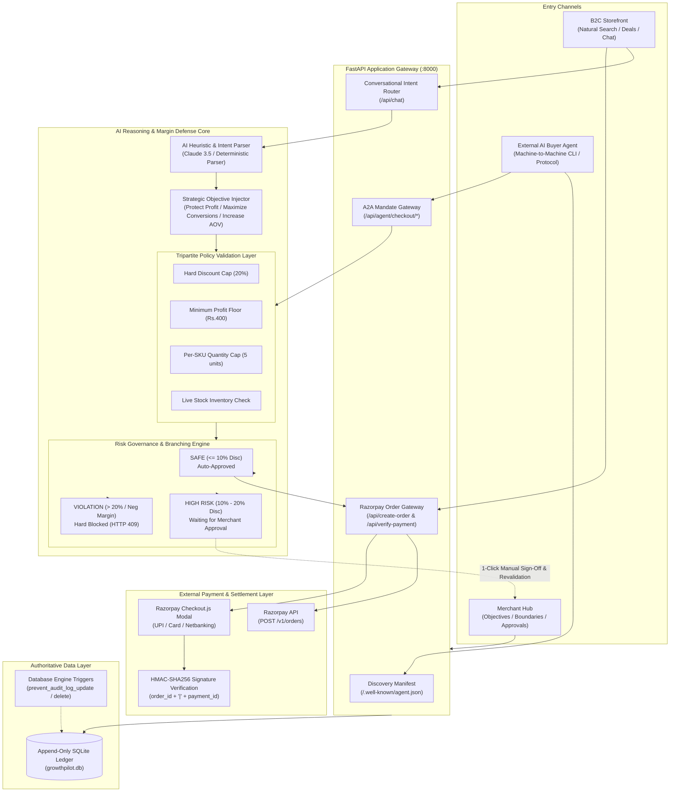

# GrowthPilot AI
> **"The merchant controls the boundaries. The AI operates inside them."**

An **agentic commerce & margin defense gateway** that empowers online merchants to deploy autonomous conversational sales assistants and accept machine-to-machine transactions from external AI buyers **without risking uncontrolled financial concessions**.

---

## Key Value Pillars in 30 Seconds

1. **AI Grows Merchant Revenue**: Autonomous conversational sales assistant understands customer intent, resolves price resistance, and recommends category-aligned upsells/cross-sells.
2. **External AI Buyers Can Transact**: Standardized machine-readable discovery (`/.well-known/agent.json`), sanitized public catalog (`/api/agent/catalog`), and HMAC-SHA256 signed checkout intents (`/api/agent/checkout/intent`).
3. **AI Cannot Make Uncontrolled Financial Decisions**: Tripartite server-side policy validation layer enforces hard discount caps, unit profit floors, and quantity limits before payment orders are created. High-risk actions require merchant approval with live server-side revalidation.

---

## 10-Scene Hackathon Demonstration

| Scene | Action / Trigger | What Happens | What It Proves |
| :--- | :--- | :--- | :--- |
| **1. Natural Search** | Click `1. Natural Search` | AI curates top matched earbud options with pricing & specs. | Natural intent understanding & catalog search. |
| **2. Price Objection** | Click `2. Price Objection` | Under **Protect Profit**, AI proposes a cheaper alternative or shipping waiver to defend margin. | Margin defense without giving away profit. |
| **3. Objective Shift** | Switch Merchant Objective to **Maximize Conversions** in Hub | AI dynamically shifts strategy to offer a direct 10% discount (`GROWTH10`). | Merchant objective directly steers AI decision-making. |
| **4. AI Inspector** | Open **AI Inspector** sidebar | Displays live 7-stage lifecycle: `Signal → Context → Proposal → Policy → Gate → Action → Audit`. | Transparent, explainable decision pipeline. |
| **5. Approval Gate** | Click `4. High-Risk Gate (15%)` | Proposal exceeds 10% threshold → paused as `WAITING FOR MERCHANT APPROVAL`. | High-risk actions cannot execute without sign-off. |
| **6. Merchant Sign-Off** | Click **Approve** in Merchant Hub | Backend revalidates stock & margin floor → approves → unlocks checkout. | Server-side revalidation protects against stale approvals. |
| **7. Hard Safety Block** | Click `5. Hard Block (25%)` | Exceeds 20% hard cap → **BLOCKED**. AI explains limit without creating an approval. | Merchant approval cannot override hard boundaries. |
| **8. Razorpay Checkout** | Click **Buy Now** or confirm checkout | Opens official Razorpay modal → complete payment → HMAC-SHA256 verified → celebration. | Real payment order generation & cryptographic verification. |
| **9. A2A Happy Path** | Run `python buyer_agent.py` | External AI discovers store → signs mandate → backend creates Razorpay order (`HTTP 200`). | Standard machine-to-machine agent commerce. |
| **10. A2A Policy Block** | Run `python buyer_agent.py --block` | Buyer agent requests 12 units → backend blocks with `HTTP 409` & retry suggestion. | Graceful failure handling for external AI agents. |

---

## Tripartite Policy & Governance Engine

```
+------------------------------------------------------------------------------------------+
|  SAFE ZONE (0% - 10% Discount)      --> Auto-Approved (if stock & margin floor pass)     |
|  APPROVAL GATE (>10% - 20% Discount)--> Held for Merchant Approval (Queued in Hub)       |
|  HARD BOUNDARY (>20% Discount, >5 Qty)-> Hard Blocked (HTTP 409 / No Override Possible)  |
+------------------------------------------------------------------------------------------+
```

- **Server-Side Revalidation**: Approving a held action revalidates current inventory, active margin floor, and discount cap before applying state changes.
- **Append-Only Audit Ledger**: Every proposal, decision gate, and checkout commits an authoritative `AUD-XXXX` event to SQLite, protected by database engine triggers (`prevent_audit_log_update`, `prevent_audit_log_delete`).
- **Zero Margin Leakage**: Wholesale unit costs (`cost_price`) and internal rupee profit margins are strictly redacted from public catalog feeds and client telemetry.

---

## System Architecture



### Tech Stack
- **Frontend**: React 18, Vite, Tailwind CSS, Lucide Icons, Recharts, Canvas Confetti
- **Backend**: Python 3.13, FastAPI, Uvicorn, Pydantic
- **Database**: SQLite3 with Engine-Level Immutability Triggers
- **Payments**: Razorpay Standard Web Checkout (`checkout.js` + Orders API + HMAC-SHA256 signature verification)
- **Agent Protocol**: Machine-Readable Manifest, Canonical JSON Normalization, HMAC-SHA256 Signing

---

## Quick Start & Setup

### 1. Environment Configuration
Copy `.env.example` to `.env`:
```env
# Optional: Anthropic Claude API Key (falls back to deterministic heuristic parser if empty)
CLAUDE_API_KEY=

# Razorpay Test Mode API Credentials
RAZORPAY_KEY_ID=rzp_test_your_key_id_here
RAZORPAY_KEY_SECRET=your_razorpay_secret_here

# Buyer Agent Shared Secret for HMAC-SHA256 mandate signing
AGENT_BUYER_SECRET=growthpilot-demo-secret
```

### 2. Install & Run
```bash
# Install Python backend dependencies
pip install -r requirements.txt

# Install & run React frontend
cd frontend
npm install
npm run dev
```

In a second terminal, launch the FastAPI server:
```bash
python app.py
```

- **Storefront**: [http://localhost:5173](http://localhost:5173)
- **Merchant Hub**: [http://localhost:5173/#merchant](http://localhost:5173/#merchant)
- **API Documentation**: [http://127.0.0.1:8000/docs](http://127.0.0.1:8000/docs)

### 3. Run Autonomous Buyer Agent (CLI)
```bash
# Happy path machine-to-machine checkout:
python buyer_agent.py

# Policy block graceful failure simulation (12 units):
python buyer_agent.py --block
```
