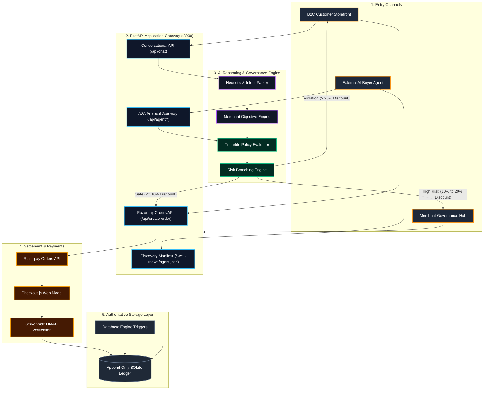
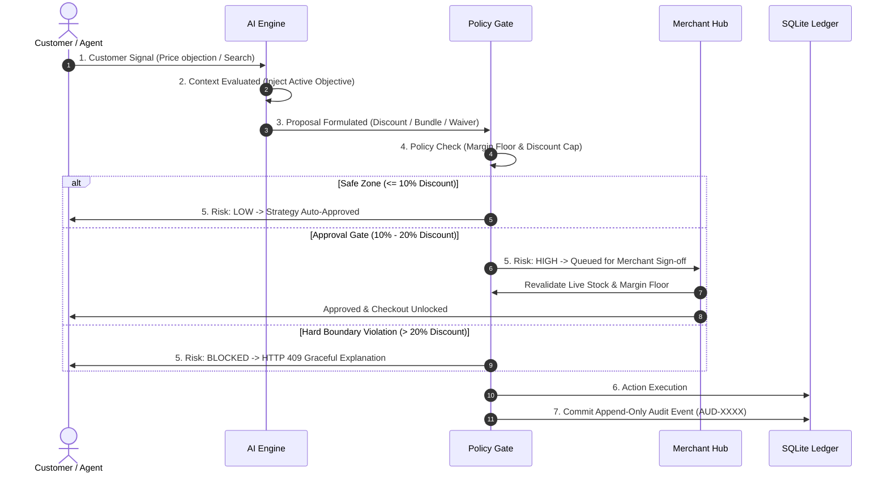
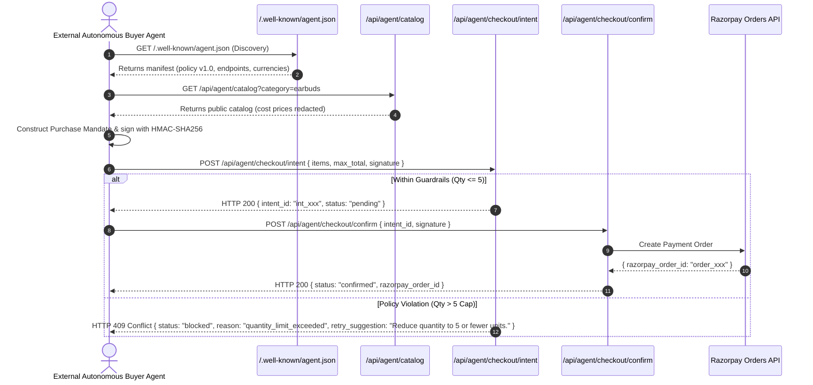

# GrowthPilot AI — System Architecture & Design Specification

> **"The merchant controls the boundaries. The AI operates inside them."**

This document provides complete architectural flowcharts, sequence diagrams, and protocol specifications for the GrowthPilot AI platform.

---

## 1. High-Level System Architecture



---

## 2. Text-Based Architecture Layout

```text
+---------------------------------------------------------------------------------------------------------+
|                                        GROWTHPILOT AI ARCHITECTURE                                      |
+------------------------------------+------------------------------------+-------------------------------+
|        STOREFRONT (B2C)            |        EXTERNAL AI BUYERS (M2M)    |      MERCHANT HUB             |
|   • Natural language search        |   • Machine discovery (agent.json) |   • Strategic objective toggle|
|   • Objective-driven negotiation   |   • Redacted catalog feed          |   • Policy boundary controls  |
|   • Dynamic cross-sell / upsell    |   • HMAC-SHA256 signed mandates    |   • 1-Click approval queue    |
|   • Live Decision Inspector (7 Stg)|   • 2-Step Commit (Intent->Confirm)|   • Append-only SQLite audit  |
+-----------------+------------------+-----------------+------------------+---------------+---------------+
                  |                                    |                                  |
                  +------------------------------------+----------------------------------+
                                                       |
                                            [ FASTAPI GATEWAY :8000 ]
                                                       |
                          +----------------------------+----------------------------+
                          |                                                         |
              [ AI REASONING / HEURISTICS ]                             [ TRIPARTITE POLICY ENGINE ]
              • Natural language parser                                 • Hard Discount Cap (20%)
              • Dynamic objective injection                             • Unit Margin Floor (Rs.400)
              • Category accessory bundler                              • Max Qty Per SKU (5 units)
                          |                                             • Inventory Stock Check
                          +----------------------------+----------------------------+
                                                       |
                                        [ RISK GATE & BRANCHING ENGINE ]
                                                       |
                        +------------------------------+------------------------------+
                        |                              |                              |
                   [ APPROVED ]              [ WAITING FOR APPROVAL ]            [ BLOCKED ]
                 (Auto-Executed)               (Merchant Sign-off)            (Hard 409 Halt)
                        |                              |                              |
                        +------------------------------+------------------------------+
                                                       |
                                        [ RAZORPAY PAYMENT GATEWAY ]
                                        • Orders API (/api/create-order)
                                        • Checkout.js Standard Web Modal
                                        • HMAC-SHA256 Signature Verification
                                                       |
                                    [ APPEND-ONLY SQLITE AUDIT LEDGER ]
                                    • Database engine triggers prevent UPDATE/DELETE
                                    • Authoritative chronological trail (AUD-XXXX)
```

---

## 3. The 7-Stage Live Decision Telemetry Pipeline



---

## 4. Machine-to-Machine (A2A) Commerce Sequence


